# Nothing.Digital — Principal Architect Plan

> **Document:** `01-principal-architect.md`  
> **Version:** 2.0  
> **Status:** Comprehensive Architecture Plan  
> **Company:** Nothing.Digital — Digital Services Agency  
> **Domain:** nothing.digital  
> **Services:** Website Development, Software Solutions, Applications, Email Marketing

---

## Table of Contents

1. [System Architecture](#1-system-architecture)
2. [The `nothing://` Protocol Strategy](#2-the-nothing-protocol-strategy)
3. [Page & Route Architecture](#3-page--route-architecture)
4. [Component Design System](#4-component-design-system)
5. [Data Architecture](#5-data-architecture)
6. [Third-Party Integrations](#6-third-party-integrations)
7. [Implementation Roadmap](#7-implementation-roadmap)

---

## 1. System Architecture

### 1.1 Technology Stack

| Layer | Technology | Purpose |
|-------|-----------|---------|
| Framework | Next.js 14 (App Router) | React framework with SSR/SSG/ISR |
| Language | TypeScript 5.x | Type safety across the stack |
| Styling | Tailwind CSS 3.x | Utility-first CSS |
| UI Components | shadcn/ui + Radix | Accessible, composable primitives |
| State Management | Zustand (UI) + React Query (Server) | Separated client/server state |
| Forms | React Hook Form + Zod | Type-safe form handling |
| Animation | Framer Motion | Declarative animations |
| Icons | Lucide React | Consistent iconography |
| Content | MDX (next-mdx-remote) | Blog posts & case studies |
| Testing | Vitest + Playwright | Unit + E2E testing |

### 1.2 High-Level Architecture

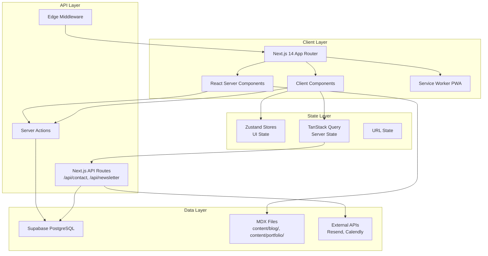

### 1.3 Component Hierarchy — Atomic Design

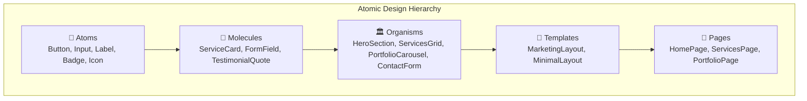

#### Folder Structure

```
components/
├── atoms/                    # Smallest building blocks
│   ├── button.tsx
│   ├── badge.tsx
│   ├── icon.tsx
│   └── divider.tsx
│
├── molecules/                # Composed atoms
│   ├── service-card.tsx
│   ├── portfolio-card.tsx
│   ├── testimonial-card.tsx
│   ├── form-field.tsx
│   └── nav-link.tsx
│
├── organisms/                # Complex sections
│   ├── hero-section.tsx
│   ├── services-grid.tsx
│   ├── portfolio-carousel.tsx
│   ├── testimonials-slider.tsx
│   ├── contact-form.tsx
│   └── footer.tsx
│
├── templates/                # Page layouts
│   ├── marketing-layout.tsx
│   └── minimal-layout.tsx
│
└── providers/                # Context providers
    ├── theme-provider.tsx
    └── query-provider.tsx
```

### 1.4 State Management Architecture

#### Server State (TanStack Query / React Query)

Server state is cacheable data that lives on the server — contact submissions, newsletter subscribers, case study data:

```typescript
// hooks/use-contact-submissions.ts
import { useQuery, useMutation, useQueryClient } from '@tanstack/react-query';

export function useContactSubmissions() {
  return useQuery({
    queryKey: ['contact-submissions'],
    queryFn: async () => {
      const res = await fetch('/api/contact');
      if (!res.ok) throw new Error('Failed to fetch submissions');
      return res.json();
    },
    staleTime: 5 * 60 * 1000, // 5 minutes
  });
}

export function useSubmitContact() {
  const queryClient = useQueryClient();

  return useMutation({
    mutationFn: async (data: ContactFormInput) => {
      const res = await fetch('/api/contact', {
        method: 'POST',
        headers: { 'Content-Type': 'application/json' },
        body: JSON.stringify(data),
      });
      if (!res.ok) throw new Error('Submission failed');
      return res.json();
    },
    onSuccess: () => {
      queryClient.invalidateQueries({ queryKey: ['contact-submissions'] });
    },
  });
}
```

#### Client State (Zustand)

Client state is local, non-persistent UI state:

```typescript
// stores/ui-store.ts
import { create } from 'zustand';
import { devtools, persist } from 'zustand/middleware';

interface UIState {
  mobileMenuOpen: boolean;
  theme: 'light' | 'dark' | 'system';
  activeService: string | null;
  scrollProgress: number;

  toggleMobileMenu: () => void;
  setTheme: (theme: UIState['theme']) => void;
  setActiveService: (service: string | null) => void;
  setScrollProgress: (progress: number) => void;
}

export const useUIStore = create<UIState>()(
  devtools(
    persist(
      (set) => ({
        mobileMenuOpen: false,
        theme: 'system',
        activeService: null,
        scrollProgress: 0,

        toggleMobileMenu: () =>
          set((state) => ({ mobileMenuOpen: !state.mobileMenuOpen })),
        setTheme: (theme) => set({ theme }),
        setActiveService: (activeService) => set({ activeService }),
        setScrollProgress: (scrollProgress) => set({ scrollProgress }),
      }),
      { name: 'nothing-ui-storage' }
    )
  )
);
```

#### URL State

URL state is shareable, bookmarkable state for portfolio filters, blog tags:

```typescript
// hooks/use-portfolio-filters.ts
import { useRouter, useSearchParams } from 'next/navigation';

interface PortfolioFilters {
  industry: string;
  service: string;
  sort: 'newest' | 'oldest' | 'alphabetical';
}

const DEFAULTS: PortfolioFilters = {
  industry: 'all',
  service: 'all',
  sort: 'newest',
};

export function usePortfolioFilters() {
  const router = useRouter();
  const searchParams = useSearchParams();

  const filters: PortfolioFilters = {
    industry: searchParams.get('industry') ?? DEFAULTS.industry,
    service: searchParams.get('service') ?? DEFAULTS.service,
    sort: (searchParams.get('sort') as PortfolioFilters['sort']) ?? DEFAULTS.sort,
  };

  const setFilters = (updates: Partial<PortfolioFilters>) => {
    const params = new URLSearchParams(searchParams);
    Object.entries(updates).forEach(([key, value]) => {
      if (value === undefined || value === DEFAULTS[key as keyof PortfolioFilters]) {
        params.delete(key);
      } else {
        params.set(key, value);
      }
    });
    router.push(`/portfolio?${params.toString()}`, { scroll: false });
  };

  return [filters, setFilters] as const;
}
```

### 1.5 Data Flow Patterns

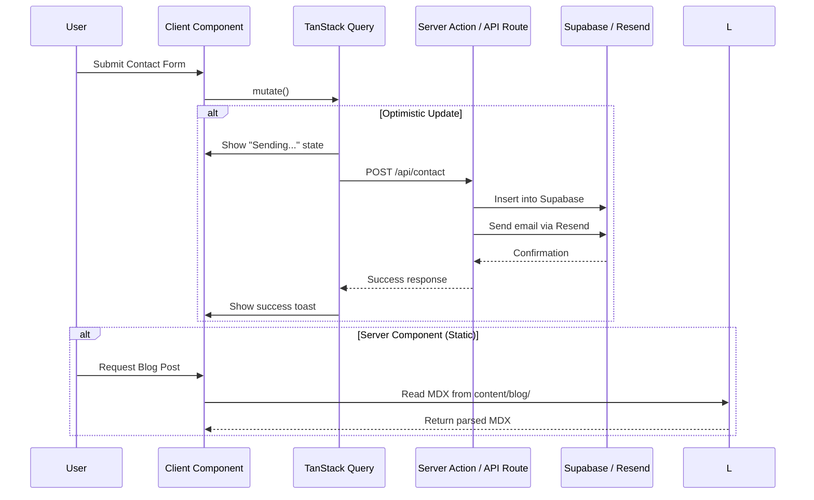

### 1.6 API Routes Design

```
app/
├── api/
│   ├── contact/
│   │   └── route.ts            # POST /api/contact
│   ├── newsletter/
│   │   └── route.ts            # POST /api/newsletter
│   └── health/
│       └── route.ts            # GET /api/health
```

#### Contact Form API Route

```typescript
// app/api/contact/route.ts
import { NextRequest, NextResponse } from 'next/server';
import { z } from 'zod';
import { createClient } from '@supabase/supabase-js';
import { Resend } from 'resend';

const contactSchema = z.object({
  name: z.string().min(1, 'Name is required').max(100),
  email: z.string().email('Valid email required'),
  company: z.string().max(100).optional(),
  service: z.enum(['website-development', 'software-solutions', 'applications', 'email-marketing', 'other']),
  message: z.string().min(10, 'Message must be at least 10 characters').max(2000),
  budget: z.enum(['<5k', '5k-15k', '15k-50k', '50k+']).optional(),
});

const supabase = createClient(
  process.env.SUPABASE_URL!,
  process.env.SUPABASE_SERVICE_KEY!
);
const resend = new Resend(process.env.RESEND_API_KEY!);

export async function POST(request: NextRequest) {
  try {
    const body = await request.json();
    const validated = contactSchema.parse(body);

    // Store in Supabase
    const { data: submission, error: dbError } = await supabase
      .from('contact_submissions')
      .insert([{
        name: validated.name,
        email: validated.email,
        company: validated.company,
        service: validated.service,
        message: validated.message,
        budget: validated.budget,
        status: 'new',
      }])
      .select()
      .single();

    if (dbError) throw dbError;

    // Send confirmation email to user
    await resend.emails.send({
      from: 'Nothing.Digital <hello@nothing.digital>',
      to: validated.email,
      subject: 'We received your message — Nothing.Digital',
      html: contactConfirmationEmailTemplate(validated),
    });

    // Send notification to team
    await resend.emails.send({
      from: 'Nothing.Digital <hello@nothing.digital>',
      to: 'team@nothing.digital',
      subject: `New contact submission from ${validated.name}`,
      html: teamNotificationEmailTemplate(validated, submission.id),
    });

    return NextResponse.json(
      { success: true, message: 'Submission received' },
      { status: 201 }
    );
  } catch (error) {
    if (error instanceof z.ZodError) {
      return NextResponse.json(
        { error: 'Validation failed', details: error.errors },
        { status: 400 }
      );
    }
    console.error('Contact submission error:', error);
    return NextResponse.json(
      { error: 'Internal Server Error' },
      { status: 500 }
    );
  }
}
```

#### Newsletter Subscribe API Route

```typescript
// app/api/newsletter/route.ts
import { NextRequest, NextResponse } from 'next/server';
import { z } from 'zod';
import { createClient } from '@supabase/supabase-js';
import { Resend } from 'resend';

const newsletterSchema = z.object({
  email: z.string().email('Valid email required'),
});

const supabase = createClient(
  process.env.SUPABASE_URL!,
  process.env.SUPABASE_SERVICE_KEY!
);
const resend = new Resend(process.env.RESEND_API_KEY!);

export async function POST(request: NextRequest) {
  try {
    const body = await request.json();
    const { email } = newsletterSchema.parse(body);

    // Check if already subscribed
    const { data: existing } = await supabase
      .from('newsletter_subscribers')
      .select('id')
      .eq('email', email)
      .single();

    if (existing) {
      return NextResponse.json(
        { success: true, message: 'Already subscribed' },
        { status: 200 }
      );
    }

    // Insert new subscriber
    const { error: dbError } = await supabase
      .from('newsletter_subscribers')
      .insert([{ email, subscribed_at: new Date().toISOString() }]);

    if (dbError) throw dbError;

    // Send welcome email
    await resend.emails.send({
      from: 'Nothing.Digital <hello@nothing.digital>',
      to: email,
      subject: 'Welcome to Nothing.Digital newsletter',
      html: newsletterWelcomeEmailTemplate(),
    });

    return NextResponse.json(
      { success: true, message: 'Subscribed successfully' },
      { status: 201 }
    );
  } catch (error) {
    if (error instanceof z.ZodError) {
      return NextResponse.json(
        { error: 'Validation failed', details: error.errors },
        { status: 400 }
      );
    }
    return NextResponse.json(
      { error: 'Internal Server Error' },
      { status: 500 }
    );
  }
}
```

### 1.7 Rendering Strategy Matrix

| Page/Section | Strategy | Rationale |
|-------------|----------|-----------|
| Home page | Static (SSG) | Content rarely changes, maximum performance |
| Services pages | Static (SSG) | Marketing content, no user-specific data |
| Portfolio list | Static (SSG) | MDX-based, build-time generation |
| Portfolio detail (`/portfolio/[slug]`) | Static (SSG) with `generateStaticParams` | Pre-render all case studies at build |
| Blog list | Static (SSG) with ISR (`revalidate: 3600`) | New posts added, hourly refresh |
| Blog post (`/blog/[slug]`) | Static (SSG) | MDX frontmatter, build-time |
| About page | Static (SSG) | Semi-static content |
| Contact page | Static (SSG) + Client components for form | Form interactivity on static page |
| API Routes | Edge/Node | Contact form, newsletter — need DB access |

### 1.8 Server Components vs Client Components Strategy

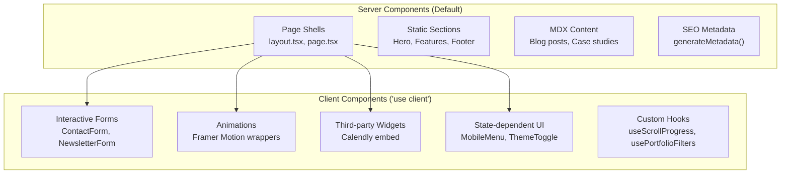

**Rule of thumb:** Start every component as a Server Component. Only add `'use client'` when you need:
- Browser APIs (`window`, `document`)
- React hooks (`useState`, `useEffect`)
- Event handlers (`onClick`, `onSubmit`)
- Third-party client libraries (Framer Motion, React Hook Form)

---

## 2. The `nothing://` Protocol Strategy

> **⚠️ CRITICAL BRAND REQUIREMENT:** The browser address bar must display `nothing://` instead of `https://`.

### 2.1 The Hard Truth

**`nothing://` in a standard web browser address bar is technically impossible for web content.**

Browsers are hardcoded to display protocols they understand (`http://`, `https://`, `file://`, `ftp://`, etc.). Custom protocols like `nothing://` cannot be used to serve web content in standard browsers. This is not a limitation we can work around — it is a fundamental security and architecture boundary of the web platform.

> **Honest Assessment:** If the brand absolutely requires `nothing://` visible in the address bar, the ONLY viable path is a **desktop application** (Electron or Tauri) where we control the entire browser shell.

---

### 2.2 Option A: PWA Protocol Handlers

The W3C Protocol Handlers API allows PWAs to register as handlers for specific URL schemes, but **only with a `web+` prefix**.

```json
// public/manifest.json
{
  "name": "Nothing.Digital",
  "short_name": "Nothing",
  "start_url": "/",
  "display": "standalone",
  "protocol_handlers": [
    {
      "protocol": "web+nothing",
      "url": "/resolve?uri=%s"
    }
  ]
}
```

```typescript
// app/resolve/page.tsx
'use client';

import { useEffect } from 'react';
import { useSearchParams, useRouter } from 'next/navigation';

export default function ResolvePage() {
  const searchParams = useSearchParams();
  const router = useRouter();
  const uri = searchParams.get('uri');

  useEffect(() => {
    if (uri) {
      // Parse web+nothing://path
      const path = uri.replace(/^web\+nothing:\/\//, '');
      router.push(`/${path}`);
    }
  }, [uri, router]);

  return (
    <div className="flex min-h-screen items-center justify-center">
      <p className="text-muted-foreground">Resolving {uri}...</p>
    </div>
  );
}
```

#### PWA Protocol Handler Analysis

| Dimension | Assessment |
|-----------|------------|
| **Can show `nothing://`?** | ❌ **NO.** Browsers require `web+` prefix. URL in address bar shows `web+nothing://`, not `nothing://`. |
| **Browser Support** | Chrome/Edge (Chromium 96+), Opera. **Safari: NO. Firefox: NO.** |
| **User Experience** | Requires PWA installation. After install, OS-level links to `web+nothing://` open in PWA. |
| **Security** | Sandboxed within PWA context. Cannot escape browser security model. |
| **Development Effort** | Low. Add `protocol_handlers` to manifest + resolver page. |
| **Feasibility Verdict** | ⚠️ Partial. Enables protocol-like behavior but **cannot fulfill the brand requirement** of `nothing://`. |

**Conclusion:** PWA Protocol Handlers are a nice-to-have for deep-linking but do NOT solve the `nothing://` requirement.

---

### 2.3 Option B: Browser Extension

A browser extension can intercept `nothing://` URLs and redirect them to the web app.

```javascript
// extension/background.js (Manifest V3)
chrome.webNavigation.onBeforeNavigate.addListener(
  (details) => {
    if (details.url.startsWith('nothing://')) {
      const path = details.url.replace('nothing://', '');
      const redirectUrl = `https://nothing.digital/${path}`;
      chrome.tabs.update(details.tabId, { url: redirectUrl });
    }
  },
  { url: [{ schemes: ['nothing'] }] }
);
```

```json
// extension/manifest.json
{
  "manifest_version": 3,
  "name": "Nothing.Digital Protocol Handler",
  "version": "1.0",
  "permissions": ["webNavigation", "tabs"],
  "background": {
    "service_worker": "background.js"
  },
  "icons": {
    "16": "icon16.png",
    "48": "icon48.png",
    "128": "icon128.png"
  }
}
```

#### Browser Extension Analysis

| Dimension | Assessment |
|-----------|------------|
| **Can show `nothing://`?** | ❌ **NO.** Extensions can intercept `nothing://` but the browser **immediately redirects** to `https://`. The address bar shows `https://nothing.digital/...` — never `nothing://`. |
| **Can modify omnibox display?** | ❌ **ABSOLUTELY NOT.** Chrome/Firefox extensions have **zero API access** to change the protocol portion of the address bar. This is a core browser security invariant. |
| **Browser Support** | Chrome, Edge, Firefox (with manifest differences). |
| **User Experience** | Terrible. Requires extension installation. Extension store approval. Users without extension get protocol error pages. |
| **Security** | Extension has broad `webNavigation` permission — trust barrier for users. |
| **Development Effort** | Low-Medium. Simple redirect extension, but multi-browser packaging is tedious. |
| **Feasibility Verdict** | ❌ **Not viable.** Cannot display `nothing://` in address bar. Creates friction for zero brand benefit. |

**Conclusion:** Browser extensions are a dead end for the `nothing://` display requirement. They can only redirect, not rebrand the address bar.

---

### 2.4 Option C: Electron / Tauri Desktop App

This is the **ONLY** approach that can genuinely display `nothing://` in an address bar.

#### Electron Implementation

```javascript
// electron/main.js
const { app, BrowserWindow, protocol } = require('electron');
const path = require('path');

// Register nothing:// as default protocol client
if (process.defaultApp) {
  if (process.argv.length >= 2) {
    app.setAsDefaultProtocolClient('nothing', process.execPath, [path.resolve(process.argv[1])]);
  }
} else {
  app.setAsDefaultProtocolClient('nothing');
}

let mainWindow;

function createWindow() {
  mainWindow = new BrowserWindow({
    width: 1400,
    height: 900,
    webPreferences: {
      nodeIntegration: false,
      contextIsolation: true,
      preload: path.join(__dirname, 'preload.js'),
    },
    // Custom title bar to show nothing://
    titleBarStyle: 'hiddenInset',
  });

  // Load the Next.js app (dev or production)
  const startUrl = process.env.NODE_ENV === 'development'
    ? 'http://localhost:3000'
    : `file://${path.join(__dirname, '../out/index.html')}`;

  mainWindow.loadURL(startUrl);
}

app.whenReady().then(() => {
  // Register custom protocol handler
  protocol.registerHttpProtocol('nothing', (request, callback) => {
    const url = new URL(request.url);
    const httpsUrl = `https://nothing.digital${url.pathname}${url.search}`;
    callback({ url: httpsUrl });
  });

  createWindow();
});

// Handle nothing:// deep links from OS
app.on('open-url', (event, url) => {
  event.preventDefault();
  if (mainWindow) {
    const path = url.replace('nothing://', '');
    mainWindow.loadURL(`https://nothing.digital/${path}`);
  }
});
```

#### Tauri Implementation (RECOMMENDED)

```rust
// src-tauri/src/main.rs
use tauri::{Manager, Window};
use tauri_plugin_deep_link::DeepLinkExt;

fn main() {
    tauri::Builder::default()
        .plugin(tauri_plugin_deep_link::init())
        .plugin(tauri_plugin_shell::init())
        .setup(|app| {
            // Register nothing:// protocol at OS level
            #[cfg(any(target_os = "macos", target_os = "windows"))]
            {
                app.deep_link().register("nothing").unwrap_or_else(|e| {
                    eprintln!("Failed to register deep link: {}", e);
                });
            }

            // Handle deep link events
            app.listen("deep-link", |event| {
                if let Ok(url) = event.payload().parse::<url::Url>() {
                    if url.scheme() == "nothing" {
                        let path = url.path();
                        let window = app.get_window("main").unwrap();
                        let _ = window.eval(&format!(
                            "window.location.href = 'https://nothing.digital{}'",
                            path
                        ));
                    }
                }
            });

            Ok(())
        })
        .run(tauri::generate_context!())
        .expect("error while running tauri application");
}
```

```javascript
// src/lib/tauri-bridge.ts (runs in renderer)
import { listen } from '@tauri-apps/api/event';

// Listen for deep link events
export function initDeepLinkHandler() {
  listen('deep-link', (event) => {
    const url = event.payload as string;
    if (url.startsWith('nothing://')) {
      const path = url.replace('nothing://', '');
      window.location.href = `https://nothing.digital/${path}`;
    }
  });
}
```

#### Custom Address Bar in Tauri

```typescript
// components/desktop/address-bar.tsx
'use client';

import { useState, useEffect } from 'react';

export function DesktopAddressBar() {
  const [url, setUrl] = useState('nothing://');

  useEffect(() => {
    // Override the displayed URL to show nothing:// instead of https://
    const currentPath = window.location.pathname + window.location.search;
    setUrl(`nothing://${currentPath.replace(/^\//, '')}`);
  }, []);

  const handleSubmit = (e: React.FormEvent) => {
    e.preventDefault();
    const input = url.replace('nothing://', '');
    window.location.href = `https://nothing.digital/${input}`;
  };

  return (
    <form onSubmit={handleSubmit} className="flex items-center gap-2 bg-muted px-3 py-1 rounded-md">
      <span className="text-primary font-mono text-sm">nothing://</span>
      <input
        type="text"
        value={url.replace('nothing://', '')}
        onChange={(e) => setUrl(`nothing://${e.target.value}`)}
        className="bg-transparent border-none outline-none text-sm w-64"
      />
    </form>
  );
}
```

#### Electron / Tauri Analysis

| Dimension | Electron | Tauri |
|-----------|----------|-------|
| **Can show `nothing://`?** | ✅ **YES.** Custom title bar / address bar can display any text. | ✅ **YES.** Full control over window chrome. |
| **Bundle Size** | ~150MB (includes Chromium + Node.js) | ~5MB (uses OS native WebView) |
| **Performance** | Heavy, high memory usage | Lightweight, native performance |
| **Protocol Registration** | OS-level via `setAsDefaultProtocolClient` | OS-level via deep-link plugin |
| **Development Effort** | Medium. Well-documented, large ecosystem. | Medium. Rust learning curve but simpler API. |
| **Cross-Platform** | macOS, Windows, Linux | macOS, Windows, Linux, iOS, Android |
| **Auto-Update** | electron-updater | tauri-updater |
| **Security** | Large attack surface (Chromium + Node) | Minimal attack surface (WebView only) |
| **Feasibility Verdict** | ✅ **Viable but heavy.** | ✅ **RECOMMENDED.** Best balance of capability and efficiency. |

**Conclusion:** Tauri is the optimal choice. It delivers `nothing://` branding with a ~5MB bundle vs Electron's ~150MB. The Rust backend is minimal for this use case (mostly protocol handling).

---

### 2.5 Option D: Service Worker + URL Rewriting

Service Workers **cannot** intercept navigation requests to non-HTTP protocols.

```javascript
// This WILL NOT WORK for nothing:// URLs
// service-worker.js
self.addEventListener('fetch', (event) => {
  // ❌ Service Worker scope is limited to http://, https://, and same-origin
  // ❌ nothing:// requests never reach the Service Worker
  console.log('Intercepted:', event.request.url);
});
```

#### Service Worker Analysis

| Dimension | Assessment |
|-----------|------------|
| **Can intercept `nothing://`?** | ❌ **NO.** Service Workers are scoped to `http://` and `https://` origins only. |
| **Can rewrite address bar?** | ❌ **NO.** Service Workers have zero control over browser chrome. |
| **What CAN it do?** | Cache assets, enable offline mode, background sync for forms. |
| **Feasibility Verdict** | ❌ **Not viable for protocol display.** Useful for PWA functionality only. |

**Conclusion:** Service Workers are essential for PWA features (offline, caching) but completely irrelevant to the `nothing://` requirement.

---

### 2.6 Option E: DNS-Level Approach

**This is IMPOSSIBLE. DNS resolves domain names, not URL schemes.**

#### Why DNS Cannot Help

```
┌─────────────────────────────────────────────────────────────┐
│  URL: nothing://services/website-development                │
│       ─────── ──────────────────────────────                │
│       Scheme       Path                                     │
│                                                             │
│  DNS ONLY resolves: nothing.digital → 192.0.2.1            │
│                                                             │
│  DNS has NO CONCEPT of URL schemes.                        │
│  You cannot DNS-register "nothing://" as a protocol.       │
└─────────────────────────────────────────────────────────────┘
```

DNS (Domain Name System) operates at the hostname resolution layer:
- It maps `nothing.digital` → IP address
- It handles A records, CNAME records, MX records, TXT records
- It does **NOT** parse, understand, or modify URL schemes

Even if you could add a custom DNS record type (which you can't — the root DNS infrastructure is controlled by ICANN and operates on standardized record types), browsers would still need to be taught how to handle a `nothing://` scheme. That requires browser-level code changes, not DNS configuration.

**Well-Known URI (`/.well-known/`)** is sometimes confused with protocol registration, but it only enables **discovery** — not protocol handling:

```
https://nothing.digital/.well-known/protocol-handler
{
  "protocol": "nothing",
  "handler_url": "https://nothing.digital/resolve?uri=%s",
  "preferred": false
}
```

This tells other systems "if you want to handle `nothing://`, here's a resolver" — but browsers still won't natively understand `nothing://`.

#### DNS Analysis

| Dimension | Assessment |
|-----------|------------|
| **Can create `nothing://` protocol?** | ❌ **ABSOLUTELY NOT.** DNS resolves names to IPs, period. |
| **Can modify browser behavior?** | ❌ **NO.** DNS has no channel to influence browser chrome. |
| **What CAN DNS do?** | Point `nothing.digital` to servers. Set up SPF/DKIM for email. |
| **Feasibility Verdict** | ❌ **Completely impossible.** This is a fundamental misunderstanding of how DNS and URLs work. |

---

### 2.7 Option F: Hybrid Approach (RECOMMENDED ARCHITECTURE)

Given all the constraints, the recommended strategy is a **tiered approach**:

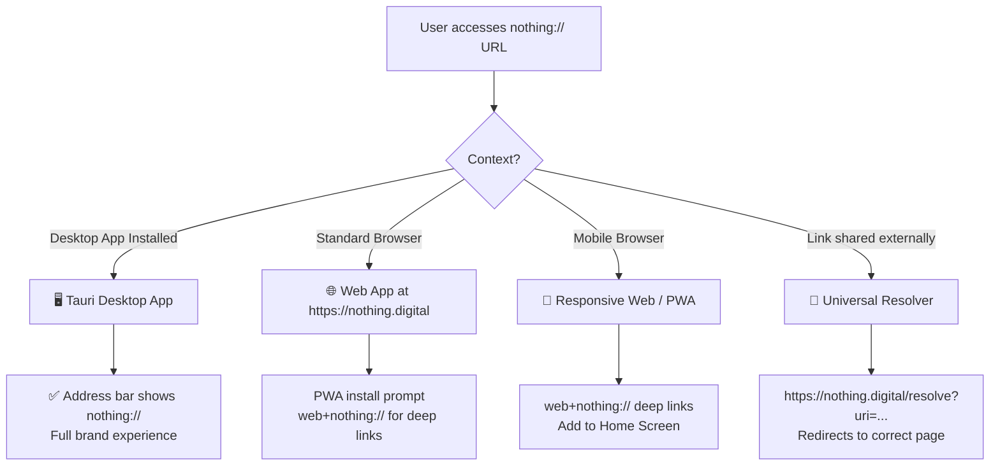

#### Hybrid Architecture Overview

| Platform | Protocol Displayed | Implementation |
|----------|-------------------|----------------|
| **Desktop (Primary)** | `nothing://` ✅ | Tauri app with custom address bar |
| **Web Fallback** | `https://` | Next.js app at nothing.digital |
| **PWA (Mobile/Desktop)** | `web+nothing://` (deep links only) | Protocol handlers in manifest |
| **Shared Links** | `https://` | Universal resolver at `/resolve` |

#### Why This Hybrid Approach Works

1. **Brand Authenticity:** Users who install the desktop app get the genuine `nothing://` experience.
2. **Accessibility:** Users without the app still access full content via `https://nothing.digital`.
3. **Shareability:** Links shared on social media, email, etc. use `https://` which works everywhere.
4. **Progressive Enhancement:** The web app is the foundation. The desktop app is an enhancement for power users.
5. **SEO:** `https://` site is fully crawlable and indexable. `nothing://` app doesn't need SEO.

---

### 2.8 Final Recommendation

```
┌────────────────────────────────────────────────────────────┐
│                     FINAL VERDICT                          │
├────────────────────────────────────────────────────────────┤
│                                                            │
│  🎯 GOAL: Display `nothing://` in browser address bar     │
│                                                            │
│  ✅ ACHIEVABLE via: Tauri Desktop Application              │
│     - Custom window chrome shows nothing://                │
│     - OS-level protocol registration                       │
│     - ~5MB bundle size                                     │
│     - Cross-platform: macOS, Windows, Linux                │
│                                                            │
│  ❌ IMPOSSIBLE via:                                        │
│     - Standard web browsers (security invariant)           │
│     - PWA Protocol Handlers (requires web+ prefix)         │
│     - Browser Extensions (cannot modify omnibox)           │
│     - Service Workers (scope limited to http/https)        │
│     - DNS / Well-Known (DNS doesn't understand schemes)    │
│                                                            │
│  🏗️ RECOMMENDED ARCHITECTURE:                              │
│     Phase 1: Build Next.js web app (https://nothing.digital)│
│     Phase 2: Wrap in Tauri for desktop (nothing://)        │
│     Phase 3: Add PWA with web+nothing:// for mobile        │
│     Phase 4: Browser extension as optional redirect aid    │
│                                                            │
└────────────────────────────────────────────────────────────┘
```

### 2.9 URL Resolution Service

```typescript
// lib/protocol/resolve.ts

interface NothingURL {
  protocol: 'nothing' | 'web+nothing' | 'https';
  path: string;
  params: Record<string, string>;
}

export function parseNothingURL(url: string): NothingURL {
  const cleanUrl = url.replace(/^(nothing|web\+nothing|https):\/\//, '');
  const [pathPart, queryString] = cleanUrl.split('?');
  const path = pathPart.replace(/^nothing\.digital\//, '');

  const params = new URLSearchParams(queryString ?? '');

  const protocol = url.startsWith('web+nothing')
    ? 'web+nothing'
    : url.startsWith('nothing://')
    ? 'nothing'
    : 'https';

  return {
    protocol,
    path,
    params: Object.fromEntries(params),
  };
}

export function resolveNothingURL(parsed: NothingURL): string {
  const { path } = parsed;

  // Route mapping
  const routes: Record<string, string> = {
    '': '/',
    'services': '/services',
    'services/website-development': '/services/website-development',
    'services/software-solutions': '/services/software-solutions',
    'services/applications': '/services/applications',
    'services/email-marketing': '/services/email-marketing',
    'portfolio': '/portfolio',
    'about': '/about',
    'blog': '/blog',
    'contact': '/contact',
  };

  // Check exact match first
  if (routes[path]) return routes[path];

  // Check pattern matches (portfolio/blog slugs)
  if (path.startsWith('portfolio/')) return `/${path}`;
  if (path.startsWith('blog/')) return `/${path}`;

  // Default fallback
  return '/';
}
```


---

## 3. Page & Route Architecture

### 3.1 Complete Route Map

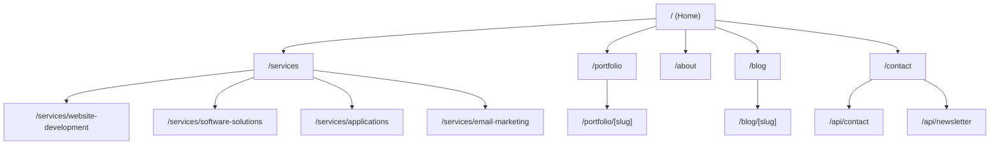

### 3.2 Route Definitions

```typescript
// lib/routes.ts
export const routes = {
  // Public Marketing Pages
  home: '/',
  services: {
    index: '/services',
    websiteDevelopment: '/services/website-development',
    softwareSolutions: '/services/software-solutions',
    applications: '/services/applications',
    emailMarketing: '/services/email-marketing',
  },
  portfolio: {
    index: '/portfolio',
    detail: (slug: string) => `/portfolio/${slug}`,
  },
  about: '/about',
  blog: {
    index: '/blog',
    post: (slug: string) => `/blog/${slug}`,
  },
  contact: '/contact',

  // API Routes
  api: {
    contact: '/api/contact',
    newsletter: '/api/newsletter',
    health: '/api/health',
  },

  // Protocol Resolver
  resolve: '/resolve',
} as const;

// Type-safe route helpers
export type ServiceSlug =
  | 'website-development'
  | 'software-solutions'
  | 'applications'
  | 'email-marketing';

export const serviceSlugs: ServiceSlug[] = [
  'website-development',
  'software-solutions',
  'applications',
  'email-marketing',
];
```

### 3.3 App Router Folder Structure

```
app/
├── layout.tsx                    # Root layout (html, body, providers)
├── page.tsx                      # Home page
├── globals.css                   # Global styles + Tailwind
│
├── services/
│   ├── page.tsx                  # Services index
│   ├── layout.tsx                # Services layout (side nav)
│   ├── website-development/
│   │   └── page.tsx              # Website Development detail
│   ├── software-solutions/
│   │   └── page.tsx              # Software Solutions detail
│   ├── applications/
│   │   └── page.tsx              # Applications detail
│   └── email-marketing/
│       └── page.tsx              # Email Marketing detail
│
├── portfolio/
│   ├── page.tsx                  # Portfolio list (filterable)
│   └── [slug]/
│       └── page.tsx              # Case study detail
│
├── about/
│   └── page.tsx                  # About page
│
├── blog/
│   ├── page.tsx                  # Blog post list
│   └── [slug]/
│       └── page.tsx              # MDX blog post
│
├── contact/
│   └── page.tsx                  # Contact form + Calendly
│
├── resolve/
│   └── page.tsx                  # Protocol resolver
│
├── api/
│   ├── contact/
│   │   └── route.ts              # POST contact form
│   ├── newsletter/
│   │   └── route.ts              # POST newsletter subscribe
│   └── health/
│       └── route.ts              # GET health check
│
├── layout.tsx                    # Root layout
├── not-found.tsx                 # 404 page
└── sitemap.ts                    # Dynamic sitemap
```

### 3.4 Page Specifications

#### Home Page (`/`)

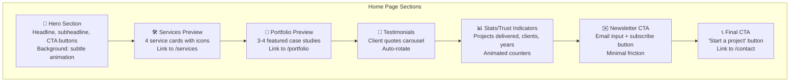

#### Services Index (`/services`)

| Element | Description |
|---------|-------------|
| Hero | "What We Do" headline + brief intro |
| Service Grid | 4 cards: Website Dev, Software, Apps, Email Marketing |
| Each Card | Icon, title, 2-line description, "Learn more" link |
| Process Section | 3-4 step workflow (Discover → Design → Develop → Deliver) |
| CTA | "Have a project in mind?" → /contact |

#### Service Detail Pages (`/services/[slug]`)

| Element | Description |
|---------|-------------|
| Hero | Service-specific headline + value proposition |
| Problem/Solution | What challenges this service solves |
| Features/Benefits | Bullet list with icons |
| Process | How we deliver this service |
| Case Studies | Related portfolio items |
| FAQ | Accordion with common questions |
| CTA | "Discuss your project" → /contact |

#### Portfolio Index (`/portfolio`)

| Element | Description |
|---------|-------------|
| Hero | "Our Work" headline |
| Filter Bar | Industry filter, Service filter, Sort dropdown |
| Case Study Grid | Cards with image, client name, industry, services used |
| Pagination | Load more or page numbers |

#### Portfolio Detail (`/portfolio/[slug]`)

| Element | Description |
|---------|-------------|
| Hero | Full-width project image |
| Client Info | Client name, industry, duration |
| Challenge | Problem the client faced |
| Solution | How Nothing.Digital helped |
| Results | Metrics, improvements, outcomes |
| Tech Stack | Technologies used |
| Testimonial | Client quote |
| Related Projects | 3 similar case studies |

#### Blog Index (`/blog`)

| Element | Description |
|---------|-------------|
| Hero | "Insights & Articles" |
| Tag Cloud | Filter by topic |
| Post Grid | Cover image, title, excerpt, date, author, read time |
| Pagination | Page numbers |

#### Blog Post (`/blog/[slug]`)

| Element | Description |
|---------|-------------|
| Header | Cover image, title, author, date, read time, tags |
| Content | MDX-rendered article |
| Author Bio | Short bio at bottom |
| Related Posts | 3 related articles |
| Newsletter CTA | Subscribe prompt |

#### About Page (`/about`)

| Element | Description |
|---------|-------------|
| Hero | Company story headline |
| Our Story | Founding story, mission, vision |
| Values | 4-5 core values with descriptions |
| Team | Team member cards (photo, name, role, bio) |
| Timeline | Company milestones |

#### Contact Page (`/contact`)

| Element | Description |
|---------|-------------|
| Hero | "Let's Build Something" |
| Contact Form | Name, email, company, service, budget, message |
| Calendly Embed | "Book a call" widget |
| Contact Info | Email, phone, address |
| FAQ | Common pre-sale questions |

### 3.5 Middleware Configuration

```typescript
// middleware.ts
import { NextResponse } from 'next/server';
import type { NextRequest } from 'next/server';

// No auth required for marketing site — all public
export async function middleware(request: NextRequest) {
  const { pathname } = request.nextUrl;

  // Redirect old /resolve URLs with nothing:// protocol
  if (pathname === '/resolve') {
    const uri = request.nextUrl.searchParams.get('uri');
    if (uri) {
      const path = uri.replace(/^(nothing|web\+nothing):\/\//, '');
      return NextResponse.redirect(new URL(`/${path}`, request.url));
    }
  }

  // Add security headers
  const response = NextResponse.next();
  response.headers.set('X-Frame-Options', 'DENY');
  response.headers.set('X-Content-Type-Options', 'nosniff');
  response.headers.set('Referrer-Policy', 'strict-origin-when-cross-origin');

  return response;
}

export const config = {
  matcher: [
    '/((?!_next/static|_next/image|favicon.ico|.*\.svg$|.*\.png$).*)',
  ],
};
```

---

## 4. Component Design System

### 4.1 Reusable Component Inventory

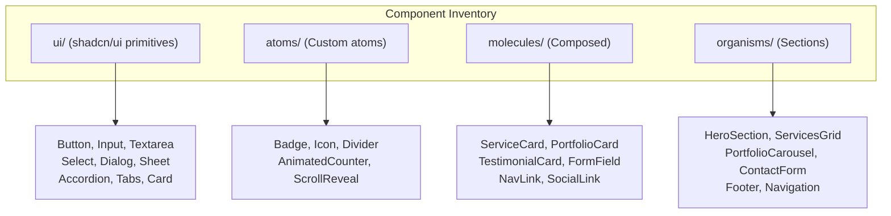

### 4.2 Core Components

#### Button Variants

```typescript
// components/atoms/button-variants.ts
import { cva } from 'class-variance-authority';

export const buttonVariants = cva(
  'inline-flex items-center justify-center rounded-md text-sm font-medium transition-colors focus-visible:outline-none focus-visible:ring-2 focus-visible:ring-ring disabled:pointer-events-none disabled:opacity-50',
  {
    variants: {
      variant: {
        default: 'bg-primary text-primary-foreground hover:bg-primary/90',
        destructive: 'bg-destructive text-destructive-foreground hover:bg-destructive/90',
        outline: 'border border-input bg-background hover:bg-accent hover:text-accent-foreground',
        secondary: 'bg-secondary text-secondary-foreground hover:bg-secondary/80',
        ghost: 'hover:bg-accent hover:text-accent-foreground',
        link: 'text-primary underline-offset-4 hover:underline',
      },
      size: {
        default: 'h-10 px-4 py-2',
        sm: 'h-9 rounded-md px-3',
        lg: 'h-11 rounded-md px-8',
        icon: 'h-10 w-10',
      },
    },
    defaultVariants: {
      variant: 'default',
      size: 'default',
    },
  }
);
```

#### Section Container

```typescript
// components/atoms/section-container.tsx
import { cn } from '@/lib/utils';

interface SectionContainerProps {
  children: React.ReactNode;
  className?: string;
  id?: string;
  variant?: 'default' | 'muted' | 'primary';
}

export function SectionContainer({
  children,
  className,
  id,
  variant = 'default',
}: SectionContainerProps) {
  return (
    <section
      id={id}
      className={cn(
        'py-16 md:py-24',
        variant === 'muted' && 'bg-muted',
        variant === 'primary' && 'bg-primary text-primary-foreground',
        className
      )}
    >
      <div className="container mx-auto px-4 md:px-6 lg:px-8">
        {children}
      </div>
    </section>
  );
}
```

#### Service Card

```typescript
// components/molecules/service-card.tsx
'use client';

import { motion } from 'framer-motion';
import { LucideIcon } from 'lucide-react';
import Link from 'next/link';
import { cn } from '@/lib/utils';

interface ServiceCardProps {
  title: string;
  description: string;
  icon: LucideIcon;
  href: string;
  className?: string;
}

export function ServiceCard({
  title,
  description,
  icon: Icon,
  href,
  className,
}: ServiceCardProps) {
  return (
    <Link href={href} className={cn('group block', className)}>
      <motion.div
        whileHover={{ y: -4 }}
        transition={{ duration: 0.2 }}
        className="rounded-lg border bg-card p-6 shadow-sm transition-colors hover:border-primary/50 hover:shadow-md"
      >
        <div className="mb-4 inline-flex h-12 w-12 items-center justify-center rounded-lg bg-primary/10 text-primary">
          <Icon className="h-6 w-6" />
        </div>
        <h3 className="mb-2 text-lg font-semibold group-hover:text-primary">
          {title}
        </h3>
        <p className="text-sm text-muted-foreground">{description}</p>
      </motion.div>
    </Link>
  );
}
```

### 4.3 Layout Patterns

#### Marketing Layout

```typescript
// components/templates/marketing-layout.tsx
import { Navigation } from '@/components/organisms/navigation';
import { Footer } from '@/components/organisms/footer';

interface MarketingLayoutProps {
  children: React.ReactNode;
}

export function MarketingLayout({ children }: MarketingLayoutProps) {
  return (
    <div className="flex min-h-screen flex-col">
      <Navigation />
      <main className="flex-1">{children}</main>
      <Footer />
    </div>
  );
}
```

#### Minimal Layout (for focused pages)

```typescript
// components/templates/minimal-layout.tsx
import Link from 'next/link';
import { Logo } from '@/components/atoms/logo';

interface MinimalLayoutProps {
  children: React.ReactNode;
  showBackLink?: boolean;
}

export function MinimalLayout({ children, showBackLink = true }: MinimalLayoutProps) {
  return (
    <div className="flex min-h-screen flex-col">
      <header className="border-b px-4 py-4">
        <div className="container mx-auto flex items-center justify-between">
          <Link href="/">
            <Logo className="h-8" />
          </Link>
          {showBackLink && (
            <Link href="/" className="text-sm text-muted-foreground hover:text-foreground">
              ← Back to home
            </Link>
          )}
        </div>
      </header>
      <main className="flex-1">{children}</main>
    </div>
  );
}
```

### 4.4 Animation Strategy (Framer Motion)

#### Page Transitions

```typescript
// components/providers/page-transition.tsx
'use client';

import { motion, AnimatePresence } from 'framer-motion';
import { usePathname } from 'next/navigation';

export function PageTransition({ children }: { children: React.ReactNode }) {
  const pathname = usePathname();

  return (
    <AnimatePresence mode="wait">
      <motion.div
        key={pathname}
        initial={{ opacity: 0, y: 10 }}
        animate={{ opacity: 1, y: 0 }}
        exit={{ opacity: 0, y: -10 }}
        transition={{ duration: 0.3, ease: 'easeInOut' }}
      >
        {children}
      </motion.div>
    </AnimatePresence>
  );
}
```

#### Scroll Reveal

```typescript
// components/atoms/scroll-reveal.tsx
'use client';

import { motion, useInView } from 'framer-motion';
import { useRef } from 'react';

interface ScrollRevealProps {
  children: React.ReactNode;
  className?: string;
  delay?: number;
  direction?: 'up' | 'down' | 'left' | 'right';
}

export function ScrollReveal({
  children,
  className,
  delay = 0,
  direction = 'up',
}: ScrollRevealProps) {
  const ref = useRef(null);
  const isInView = useInView(ref, { once: true, margin: '-100px' });

  const directionOffset = {
    up: { y: 40, x: 0 },
    down: { y: -40, x: 0 },
    left: { x: 40, y: 0 },
    right: { x: -40, y: 0 },
  };

  return (
    <motion.div
      ref={ref}
      initial={{ opacity: 0, ...directionOffset[direction] }}
      animate={isInView ? { opacity: 1, x: 0, y: 0 } : {}}
      transition={{ duration: 0.5, delay, ease: 'easeOut' }}
      className={className}
    >
      {children}
    </motion.div>
  );
}
```

#### Stagger Container

```typescript
// components/atoms/stagger-container.tsx
'use client';

import { motion } from 'framer-motion';

interface StaggerContainerProps {
  children: React.ReactNode;
  className?: string;
  staggerDelay?: number;
}

export function StaggerContainer({
  children,
  className,
  staggerDelay = 0.1,
}: StaggerContainerProps) {
  return (
    <motion.div
      initial="hidden"
      whileInView="visible"
      viewport={{ once: true, margin: '-50px' }}
      variants={{
        visible: {
          transition: {
            staggerChildren: staggerDelay,
          },
        },
      }}
      className={className}
    >
      {children}
    </motion.div>
  );
}

export function StaggerItem({
  children,
  className,
}: {
  children: React.ReactNode;
  className?: string;
}) {
  return (
    <motion.div
      variants={{
        hidden: { opacity: 0, y: 20 },
        visible: { opacity: 1, y: 0, transition: { duration: 0.4 } },
      }}
      className={className}
    >
      {children}
    </motion.div>
  );
}
```

#### Hover States

```typescript
// components/atoms/hover-scale.tsx
'use client';

import { motion } from 'framer-motion';

interface HoverScaleProps {
  children: React.ReactNode;
  className?: string;
  scale?: number;
}

export function HoverScale({ children, className, scale = 1.02 }: HoverScaleProps) {
  return (
    <motion.div
      whileHover={{ scale }}
      whileTap={{ scale: 0.98 }}
      transition={{ duration: 0.2 }}
      className={className}
    >
      {children}
    </motion.div>
  );
}
```

### 4.5 Form Patterns (React Hook Form + Zod)

```typescript
// components/organisms/contact-form.tsx
'use client';

import { useForm } from 'react-hook-form';
import { zodResolver } from '@hookform/resolvers/zod';
import { z } from 'zod';
import { useSubmitContact } from '@/hooks/use-contact';
import { Button } from '@/components/ui/button';
import { Input } from '@/components/ui/input';
import { Textarea } from '@/components/ui/textarea';
import {
  Select,
  SelectContent,
  SelectItem,
  SelectTrigger,
  SelectValue,
} from '@/components/ui/select';

const contactSchema = z.object({
  name: z.string().min(1, 'Name is required'),
  email: z.string().email('Valid email required'),
  company: z.string().optional(),
  service: z.enum([
    'website-development',
    'software-solutions',
    'applications',
    'email-marketing',
    'other',
  ]),
  budget: z.enum(['<5k', '5k-15k', '15k-50k', '50k+']).optional(),
  message: z.string().min(10, 'Message must be at least 10 characters'),
});

type ContactFormData = z.infer<typeof contactSchema>;

export function ContactForm() {
  const {
    register,
    handleSubmit,
    formState: { errors },
    reset,
  } = useForm<ContactFormData>({
    resolver: zodResolver(contactSchema),
  });

  const submitContact = useSubmitContact();

  const onSubmit = async (data: ContactFormData) => {
    await submitContact.mutateAsync(data);
    reset();
  };

  return (
    <form onSubmit={handleSubmit(onSubmit)} className="space-y-6">
      <div className="grid gap-4 md:grid-cols-2">
        <div>
          <label htmlFor="name">Name *</label>
          <Input id="name" {...register('name')} />
          {errors.name && <p className="text-sm text-destructive">{errors.name.message}</p>}
        </div>
        <div>
          <label htmlFor="email">Email *</label>
          <Input id="email" type="email" {...register('email')} />
          {errors.email && <p className="text-sm text-destructive">{errors.email.message}</p>}
        </div>
      </div>

      <div>
        <label htmlFor="company">Company</label>
        <Input id="company" {...register('company')} />
      </div>

      <div className="grid gap-4 md:grid-cols-2">
        <div>
          <label>Service Interest</label>
          <Select onValueChange={(v) => register('service').onChange({ target: { value: v } })}>
            <SelectTrigger>
              <SelectValue placeholder="Select a service" />
            </SelectTrigger>
            <SelectContent>
              <SelectItem value="website-development">Website Development</SelectItem>
              <SelectItem value="software-solutions">Software Solutions</SelectItem>
              <SelectItem value="applications">Applications</SelectItem>
              <SelectItem value="email-marketing">Email Marketing</SelectItem>
              <SelectItem value="other">Other</SelectItem>
            </SelectContent>
          </Select>
        </div>
        <div>
          <label>Budget Range</label>
          <Select onValueChange={(v) => register('budget').onChange({ target: { value: v } })}>
            <SelectTrigger>
              <SelectValue placeholder="Select budget" />
            </SelectTrigger>
            <SelectContent>
              <SelectItem value="<5k">Under $5,000</SelectItem>
              <SelectItem value="5k-15k">$5,000 – $15,000</SelectItem>
              <SelectItem value="15k-50k">$15,000 – $50,000</SelectItem>
              <SelectItem value="50k+">$50,000+</SelectItem>
            </SelectContent>
          </Select>
        </div>
      </div>

      <div>
        <label htmlFor="message">Message *</label>
        <Textarea id="message" rows={5} {...register('message')} />
        {errors.message && <p className="text-sm text-destructive">{errors.message.message}</p>}
      </div>

      <Button
        type="submit"
        disabled={submitContact.isPending}
        className="w-full md:w-auto"
      >
        {submitContact.isPending ? 'Sending...' : 'Send Message'}
      </Button>

      {submitContact.isSuccess && (
        <p className="text-sm text-green-600">Message sent successfully!</p>
      )}
    </form>
  );
}
```

### 4.6 Dark/Light Mode

```typescript
// components/providers/theme-provider.tsx
'use client';

import { createContext, useContext, useEffect, useState } from 'react';

type Theme = 'light' | 'dark' | 'system';

interface ThemeContextType {
  theme: Theme;
  setTheme: (theme: Theme) => void;
  resolvedTheme: 'light' | 'dark';
}

const ThemeContext = createContext<ThemeContextType | undefined>(undefined);

export function ThemeProvider({ children }: { children: React.ReactNode }) {
  const [theme, setThemeState] = useState<Theme>('system');
  const [resolvedTheme, setResolvedTheme] = useState<'light' | 'dark'>('light');

  useEffect(() => {
    const root = window.document.documentElement;
    const systemTheme = window.matchMedia('(prefers-color-scheme: dark)').matches ? 'dark' : 'light';
    const resolved = theme === 'system' ? systemTheme : theme;

    root.classList.remove('light', 'dark');
    root.classList.add(resolved);
    setResolvedTheme(resolved);
  }, [theme]);

  const setTheme = (newTheme: Theme) => {
    setThemeState(newTheme);
    localStorage.setItem('nothing-theme', newTheme);
  };

  useEffect(() => {
    const saved = localStorage.getItem('nothing-theme') as Theme | null;
    if (saved) setThemeState(saved);
  }, []);

  return (
    <ThemeContext.Provider value={{ theme, setTheme, resolvedTheme }}>
      {children}
    </ThemeContext.Provider>
  );
}

export function useTheme() {
  const context = useContext(ThemeContext);
  if (!context) throw new Error('useTheme must be used within ThemeProvider');
  return context;
}
```

```typescript
// components/atoms/theme-toggle.tsx
'use client';

import { Moon, Sun } from 'lucide-react';
import { useTheme } from '@/components/providers/theme-provider';
import { Button } from '@/components/ui/button';

export function ThemeToggle() {
  const { theme, setTheme, resolvedTheme } = useTheme();

  return (
    <Button
      variant="ghost"
      size="icon"
      onClick={() => setTheme(resolvedTheme === 'dark' ? 'light' : 'dark')}
      aria-label="Toggle theme"
    >
      {resolvedTheme === 'dark' ? (
        <Sun className="h-5 w-5" />
      ) : (
        <Moon className="h-5 w-5" />
      )}
    </Button>
  );
}
```

---

## 5. Data Architecture

### 5.1 Content Strategy Overview

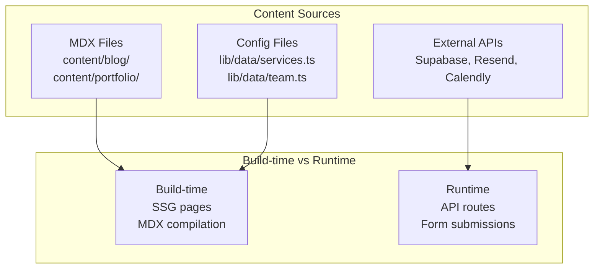

### 5.2 Content Directory Structure

```
content/
├── blog/
│   ├── building-scalable-nextjs-apps.mdx
│   ├── email-marketing-best-practices-2024.mdx
│   └── why-we-chose-tauri.mdx
│
├── portfolio/
│   ├── saas-dashboard-redesign.mdx
│   ├── e-commerce-platform-migration.mdx
│   ├── mobile-banking-app.mdx
│   └── nonprofit-email-campaign.mdx
│
└── authors/
    └── team.yml              # Author metadata
```

### 5.3 Blog Post Schema (Frontmatter)

```typescript
// lib/content/blog.ts
import { z } from 'zod';

export const blogPostSchema = z.object({
  title: z.string().min(1),
  date: z.string().regex(/^\d{4}-\d{2}-\d{2}$/),
  author: z.string(),
  tags: z.array(z.string()),
  excerpt: z.string().min(10).max(500),
  coverImage: z.string().url(),
  readingTime: z.number().optional(),
  featured: z.boolean().default(false),
  draft: z.boolean().default(false),
});

export type BlogPost = z.infer<typeof blogPostSchema> & {
  slug: string;
  content: string;
};
```

Example MDX file:

```mdx
---
title: "Building Scalable Next.js Applications"
date: "2024-03-15"
author: "alex-chen"
tags: ["nextjs", "react", "architecture"]
excerpt: "Learn the patterns we use at Nothing.Digital to build production-grade Next.js applications that scale."
coverImage: "https://images.unsplash.com/photo-1461749280684-dccba630e2f6"
featured: true
---

## Introduction

At Nothing.Digital, we've built dozens of Next.js applications...

## The App Router Advantage

The Next.js 14 App Router provides...

## Server Components Strategy

We default to Server Components for...
```

### 5.4 Case Study Schema

```typescript
// lib/content/portfolio.ts
import { z } from 'zod';

export const caseStudySchema = z.object({
  title: z.string().min(1),
  client: z.string(),
  industry: z.enum([
    'saas',
    'e-commerce',
    'healthcare',
    'finance',
    'education',
    'nonprofit',
    'other',
  ]),
  services: z.array(z.enum([
    'website-development',
    'software-solutions',
    'applications',
    'email-marketing',
  ])),
  duration: z.string(), // e.g., "3 months", "6 weeks"
  results: z.object({
    metric1: z.object({ label: z.string(), value: z.string() }),
    metric2: z.object({ label: z.string(), value: z.string() }).optional(),
    metric3: z.object({ label: z.string(), value: z.string() }).optional(),
  }),
  testimonial: z.object({
    quote: z.string(),
    author: z.string(),
    role: z.string(),
  }).optional(),
  coverImage: z.string().url(),
  gallery: z.array(z.string().url()).optional(),
  techStack: z.array(z.string()).optional(),
  featured: z.boolean().default(false),
});

export type CaseStudy = z.infer<typeof caseStudySchema> & {
  slug: string;
  content: string;
};
```

### 5.5 Content Loading Utilities

```typescript
// lib/content/loader.ts
import fs from 'fs';
import path from 'path';
import matter from 'gray-matter';
import { compileMDX } from 'next-mdx-remote/rsc';

const CONTENT_DIR = path.join(process.cwd(), 'content');

export async function getBlogPosts() {
  const blogDir = path.join(CONTENT_DIR, 'blog');
  const files = fs.readdirSync(blogDir).filter((f) => f.endsWith('.mdx'));

  const posts = await Promise.all(
    files.map(async (file) => {
      const slug = file.replace(/\.mdx$/, '');
      const filePath = path.join(blogDir, file);
      const source = fs.readFileSync(filePath, 'utf8');
      const { data, content } = matter(source);

      return {
        slug,
        ...data,
        content,
      } as BlogPost;
    })
  );

  return posts
    .filter((post) => !post.draft)
    .sort((a, b) => new Date(b.date).getTime() - new Date(a.date).getTime());
}

export async function getBlogPost(slug: string) {
  const filePath = path.join(CONTENT_DIR, 'blog', `${slug}.mdx`);

  if (!fs.existsSync(filePath)) return null;

  const source = fs.readFileSync(filePath, 'utf8');
  const { content, data } = matter(source);

  const { content: compiledContent } = await compileMDX({
    source: content,
    options: { parseFrontmatter: false },
  });

  return {
    slug,
    ...data,
    content: compiledContent,
  } as BlogPost;
}

export async function getCaseStudies() {
  const portfolioDir = path.join(CONTENT_DIR, 'portfolio');
  const files = fs.readdirSync(portfolioDir).filter((f) => f.endsWith('.mdx'));

  const studies = await Promise.all(
    files.map(async (file) => {
      const slug = file.replace(/\.mdx$/, '');
      const filePath = path.join(portfolioDir, file);
      const source = fs.readFileSync(filePath, 'utf8');
      const { data, content } = matter(source);

      return {
        slug,
        ...data,
        content,
      } as CaseStudy;
    })
  );

  return studies.sort((a, b) => (b.featured ? 1 : 0) - (a.featured ? 1 : 0));
}

export async function getCaseStudy(slug: string) {
  const filePath = path.join(CONTENT_DIR, 'portfolio', `${slug}.mdx`);

  if (!fs.existsSync(filePath)) return null;

  const source = fs.readFileSync(filePath, 'utf8');
  const { content, data } = matter(source);

  const { content: compiledContent } = await compileMDX({
    source: content,
    options: { parseFrontmatter: false },
  });

  return {
    slug,
    ...data,
    content: compiledContent,
  } as CaseStudy;
}
```

### 5.6 Static Page Generation

```typescript
// app/blog/[slug]/page.tsx
import { notFound } from 'next/navigation';
import { getBlogPosts, getBlogPost } from '@/lib/content/loader';
import { BlogPostLayout } from '@/components/templates/blog-post-layout';

// Generate static paths at build time
export async function generateStaticParams() {
  const posts = await getBlogPosts();
  return posts.map((post) => ({
    slug: post.slug,
  }));
}

// Generate metadata for each post
export async function generateMetadata({ params }: { params: { slug: string } }) {
  const post = await getBlogPost(params.slug);
  if (!post) return { title: 'Post Not Found' };

  return {
    title: `${post.title} | Nothing.Digital Blog`,
    description: post.excerpt,
    openGraph: {
      title: post.title,
      description: post.excerpt,
      images: [{ url: post.coverImage }],
    },
  };
}

export default async function BlogPostPage({ params }: { params: { slug: string } }) {
  const post = await getBlogPost(params.slug);

  if (!post) notFound();

  return <BlogPostLayout post={post} />;
}
```

```typescript
// app/portfolio/[slug]/page.tsx
import { notFound } from 'next/navigation';
import { getCaseStudies, getCaseStudy } from '@/lib/content/loader';
import { CaseStudyLayout } from '@/components/templates/case-study-layout';

export async function generateStaticParams() {
  const studies = await getCaseStudies();
  return studies.map((study) => ({
    slug: study.slug,
  }));
}

export async function generateMetadata({ params }: { params: { slug: string } }) {
  const study = await getCaseStudy(params.slug);
  if (!study) return { title: 'Case Study Not Found' };

  return {
    title: `${study.title} | Nothing.Digital Portfolio`,
    description: `See how we helped ${study.client} with ${study.services.join(', ')}.`,
  };
}

export default async function CaseStudyPage({ params }: { params: { slug: string } }) {
  const study = await getCaseStudy(params.slug);

  if (!study) notFound();

  return <CaseStudyLayout study={study} />;
}
```

### 5.7 Form Submission Flow

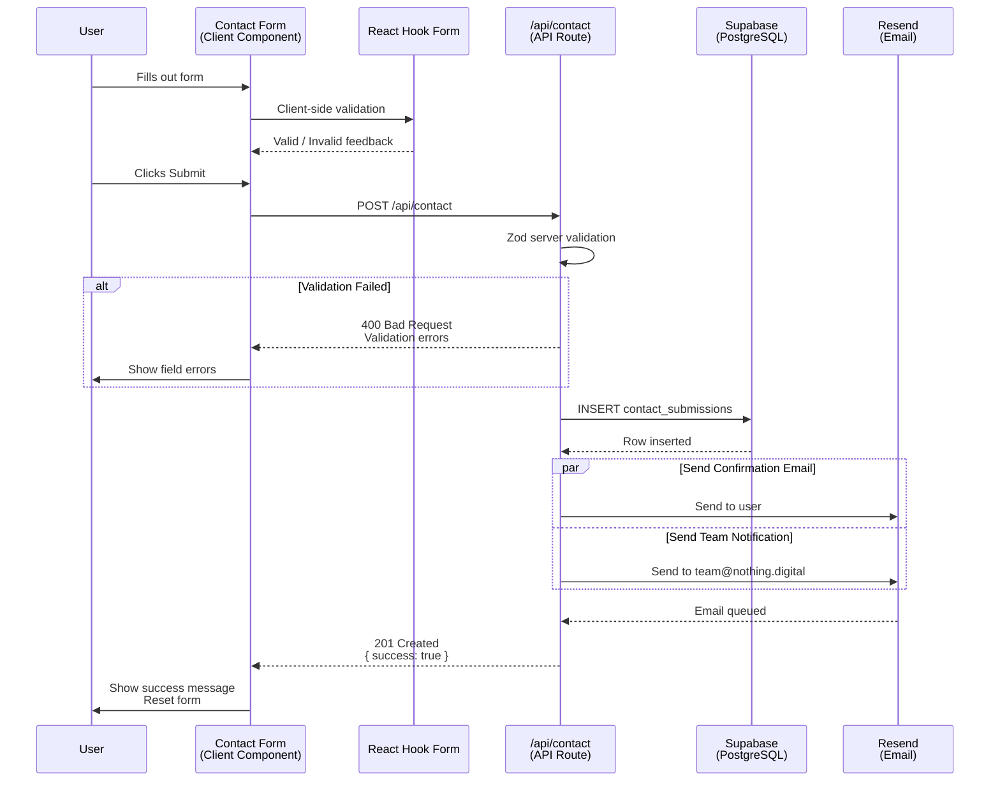

### 5.8 Static vs Dynamic Data Strategy

| Data Type | Source | Strategy | Caching |
|-----------|--------|----------|---------|
| Blog posts | MDX files | SSG — build-time | Immutable (rebuild to update) |
| Case studies | MDX files | SSG — build-time | Immutable |
| Service descriptions | Config/MDX | SSG — build-time | Immutable |
| Team info | Config file | SSG — build-time | Immutable |
| Contact submissions | Supabase | API Route — runtime | No cache (write-only from web) |
| Newsletter subscribers | Supabase | API Route — runtime | No cache |
| Email delivery | Resend | API Route — runtime | No cache |

### 5.9 Supabase Schema

```sql
-- Contact form submissions
CREATE TABLE contact_submissions (
  id UUID PRIMARY KEY DEFAULT gen_random_uuid(),
  name TEXT NOT NULL,
  email TEXT NOT NULL,
  company TEXT,
  service TEXT,
  budget TEXT,
  message TEXT NOT NULL,
  status TEXT DEFAULT 'new' CHECK (status IN ('new', 'in-progress', 'responded', 'closed')),
  created_at TIMESTAMP WITH TIME ZONE DEFAULT NOW(),
  updated_at TIMESTAMP WITH TIME ZONE DEFAULT NOW()
);

-- Newsletter subscribers
CREATE TABLE newsletter_subscribers (
  id UUID PRIMARY KEY DEFAULT gen_random_uuid(),
  email TEXT UNIQUE NOT NULL,
  subscribed_at TIMESTAMP WITH TIME ZONE DEFAULT NOW(),
  unsubscribed_at TIMESTAMP WITH TIME ZONE,
  is_active BOOLEAN DEFAULT TRUE
);

-- Indexes for performance
CREATE INDEX idx_contact_submissions_status ON contact_submissions(status);
CREATE INDEX idx_contact_submissions_created_at ON contact_submissions(created_at DESC);
CREATE INDEX idx_newsletter_subscribers_email ON newsletter_subscribers(email);
```

---

## 6. Third-Party Integrations

### 6.1 Integration Overview

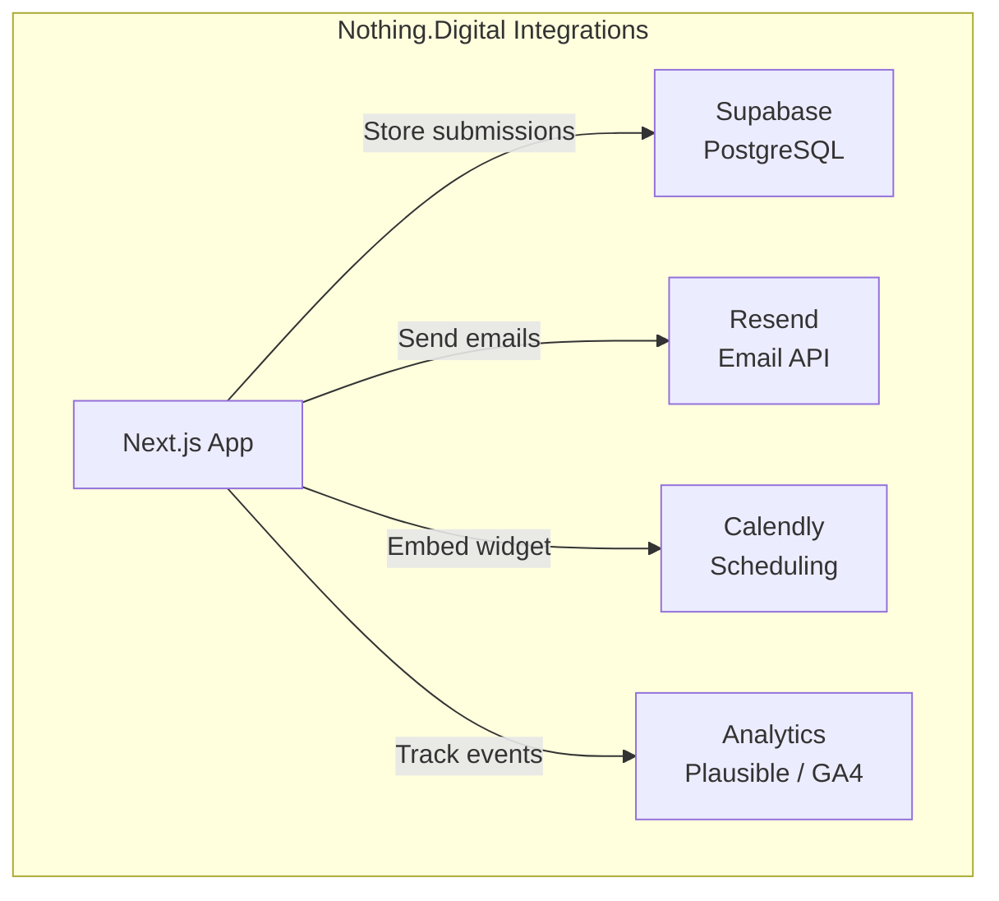

### 6.2 Supabase Integration

```typescript
// lib/supabase.ts
import { createClient } from '@supabase/supabase-js';

const supabaseUrl = process.env.SUPABASE_URL!;
const supabaseServiceKey = process.env.SUPABASE_SERVICE_KEY!;

// Server-side client (service role — for API routes only)
export const supabaseAdmin = createClient(supabaseUrl, supabaseServiceKey);

// Client-side client (anon key — for real-time features if needed)
const supabaseAnonKey = process.env.NEXT_PUBLIC_SUPABASE_ANON_KEY!;
export const supabaseClient = createClient(supabaseUrl, supabaseAnonKey);
```

#### Environment Variables

```bash
# .env.local
SUPABASE_URL=https://your-project.supabase.co
SUPABASE_SERVICE_KEY=eyJ...        # Service role key (server only)
NEXT_PUBLIC_SUPABASE_ANON_KEY=eyJ... # Anon key (client safe)
```

### 6.3 Resend Integration

```typescript
// lib/resend.ts
import { Resend } from 'resend';

export const resend = new Resend(process.env.RESEND_API_KEY!);

// Email templates
export function contactConfirmationEmailTemplate(data: {
  name: string;
  service?: string;
}) {
  return `
    <!DOCTYPE html>
    <html>
    <head>
      <meta charset="utf-8">
      <title>Thank you for contacting Nothing.Digital</title>
    </head>
    <body style="font-family: system-ui, sans-serif; max-width: 600px; margin: 0 auto; padding: 24px;">
      <h1 style="color: #000;">Hi ${data.name},</h1>
      <p>Thank you for reaching out to Nothing.Digital. We've received your message and will get back to you within 24 hours.</p>
      ${data.service ? `<p>You expressed interest in: <strong>${data.service}</strong></p>` : ''}
      <p>In the meantime, feel free to explore our <a href="https://nothing.digital/portfolio">portfolio</a> or <a href="https://nothing.digital/blog">blog</a>.</p>
      <hr style="margin: 24px 0; border: none; border-top: 1px solid #eee;">
      <p style="color: #666; font-size: 14px;">
        Nothing.Digital<br>
        hello@nothing.digital<br>
        <a href="https://nothing.digital">nothing.digital</a>
      </p>
    </body>
    </html>
  `;
}

export function teamNotificationEmailTemplate(
  data: {
    name: string;
    email: string;
    company?: string;
    service?: string;
    message: string;
  },
  submissionId: string
) {
  return `
    <!DOCTYPE html>
    <html>
    <body style="font-family: system-ui, sans-serif; max-width: 600px; margin: 0 auto; padding: 24px;">
      <h1>New Contact Submission</h1>
      <table style="width: 100%; border-collapse: collapse;">
        <tr><td style="padding: 8px; border-bottom: 1px solid #eee;"><strong>Name:</strong></td><td style="padding: 8px; border-bottom: 1px solid #eee;">${data.name}</td></tr>
        <tr><td style="padding: 8px; border-bottom: 1px solid #eee;"><strong>Email:</strong></td><td style="padding: 8px; border-bottom: 1px solid #eee;">${data.email}</td></tr>
        ${data.company ? `<tr><td style="padding: 8px; border-bottom: 1px solid #eee;"><strong>Company:</strong></td><td style="padding: 8px; border-bottom: 1px solid #eee;">${data.company}</td></tr>` : ''}
        ${data.service ? `<tr><td style="padding: 8px; border-bottom: 1px solid #eee;"><strong>Service:</strong></td><td style="padding: 8px; border-bottom: 1px solid #eee;">${data.service}</td></tr>` : ''}
        <tr><td style="padding: 8px; border-bottom: 1px solid #eee; vertical-align: top;"><strong>Message:</strong></td><td style="padding: 8px; border-bottom: 1px solid #eee;">${data.message.replace(/\n/g, '<br>')}</td></tr>
      </table>
      <p style="margin-top: 16px;">
        <a href="https://nothing.digital/admin/submissions/${submissionId}" style="background: #000; color: #fff; padding: 12px 24px; text-decoration: none; border-radius: 4px; display: inline-block;">View in Admin</a>
      </p>
    </body>
    </html>
  `;
}

export function newsletterWelcomeEmailTemplate() {
  return `
    <!DOCTYPE html>
    <html>
    <body style="font-family: system-ui, sans-serif; max-width: 600px; margin: 0 auto; padding: 24px;">
      <h1 style="color: #000;">Welcome to Nothing.Digital</h1>
      <p>Thanks for subscribing to our newsletter. You'll receive updates on:</p>
      <ul>
        <li>New projects and case studies</li>
        <li>Industry insights and best practices</li>
        <li>Tips on web development, software, and digital marketing</li>
      </ul>
      <p>Stay tuned for our next issue.</p>
    </body>
    </html>
  `;
}
```

### 6.4 Calendly Integration

```typescript
// components/organisms/calendly-widget.tsx
'use client';

import { useEffect } from 'react';

export function CalendlyWidget() {
  useEffect(() => {
    // Load Calendly widget script
    const script = document.createElement('script');
    script.src = 'https://assets.calendly.com/assets/external/widget.js';
    script.async = true;
    document.body.appendChild(script);

    return () => {
      document.body.removeChild(script);
    };
  }, []);

  return (
    <div className="rounded-lg border bg-card p-6">
      <h3 className="mb-4 text-lg font-semibold">Book a Free Consultation</h3>
      <p className="mb-4 text-sm text-muted-foreground">
        Schedule a 30-minute call to discuss your project.
      </p>
      <div
        className="calendly-inline-widget"
        data-url="https://calendly.com/nothing-digital/30min"
        style={{ minWidth: '320px', height: '630px' }}
      />
    </div>
  );
}
```

**Alternative: Calendly React Component (if using calendly-react package)**

```bash
npm install react-calendly
```

```typescript
// components/organisms/calendly-popup.tsx
'use client';

import { PopupButton } from 'react-calendly';

export function CalendlyPopupButton() {
  return (
    <PopupButton
      url="https://calendly.com/nothing-digital/30min"
      rootElement={document.getElementById('__next')!}
      text="Book a Call"
      className="inline-flex items-center justify-center rounded-md bg-primary px-6 py-3 text-sm font-medium text-primary-foreground hover:bg-primary/90"
    />
  );
}
```

### 6.5 Analytics Integration

#### Plausible (Privacy-First, RECOMMENDED)

```typescript
// components/providers/analytics.tsx
export function PlausibleAnalytics() {
  return (
    <script
      defer
      data-domain="nothing.digital"
      src="https://plausible.io/js/script.js"
    />
  );
}
```

#### GA4 (Alternative)

```typescript
// components/providers/analytics.tsx
import Script from 'next/script';

export function GA4Analytics() {
  const gaId = process.env.NEXT_PUBLIC_GA_ID;

  if (!gaId) return null;

  return (
    <>
      <Script
        src={`https://www.googletagmanager.com/gtag/js?id=${gaId}`}
        strategy="afterInteractive"
      />
      <Script id="ga4" strategy="afterInteractive">
        {`
          window.dataLayer = window.dataLayer || [];
          function gtag(){dataLayer.push(arguments);}
          gtag('js', new Date());
          gtag('config', '${gaId}', {
            page_title: document.title,
            page_location: window.location.href,
          });
        `}
      </Script>
    </>
  );
}
```

#### Custom Event Tracking

```typescript
// lib/analytics.ts
type AnalyticsEvent =
  | { name: 'contact_form_submit'; params: { service: string } }
  | { name: 'newsletter_subscribe'; params: {} }
  | { name: 'portfolio_view'; params: { slug: string } }
  | { name: 'service_page_view'; params: { service: string } }
  | { name: 'calendly_click'; params: {} };

export function trackEvent(event: AnalyticsEvent) {
  // Plausible
  if (typeof window !== 'undefined' && (window as any).plausible) {
    (window as any).plausible(event.name, { props: event.params });
  }

  // GA4
  if (typeof window !== 'undefined' && (window as any).gtag) {
    (window as any).gtag('event', event.name, event.params);
  }
}
```

### 6.6 Integration Summary Table

| Integration | Purpose | Data Flow | Privacy |
|-------------|---------|-----------|---------|
| **Supabase** | Contact submissions, newsletter subscribers | Next.js API → PostgreSQL | Self-hosted, data owned |
| **Resend** | Transactional emails (confirmations, notifications) | API Route → Resend API | Email only, no tracking pixels |
| **Calendly** | Meeting booking widget | Embed iframe | User opts into Calendly TOS |
| **Plausible** | Privacy-first analytics | Lightweight script | No cookies, no personal data |
| **GA4** | Alternative analytics (if needed) | Script + event tracking | Cookie-based, requires consent |

### 6.7 What's NOT Included (Intentionally)

| Service | Why Not Needed |
|---------|---------------|
| **Stripe** | This is a services/agency site, not a SaaS. Payments handled via invoice/contract. |
| **Auth System** | No user accounts, no dashboards, no protected routes. All content is public. |
| **CMS (Sanity/Strapi)** | MDX files + config files are sufficient. No non-technical content editors. |
| **Search (Algolia)** | Site is small enough for client-side search on blog/portfolio. |

---

## 7. Implementation Roadmap

### 7.1 Phase Overview

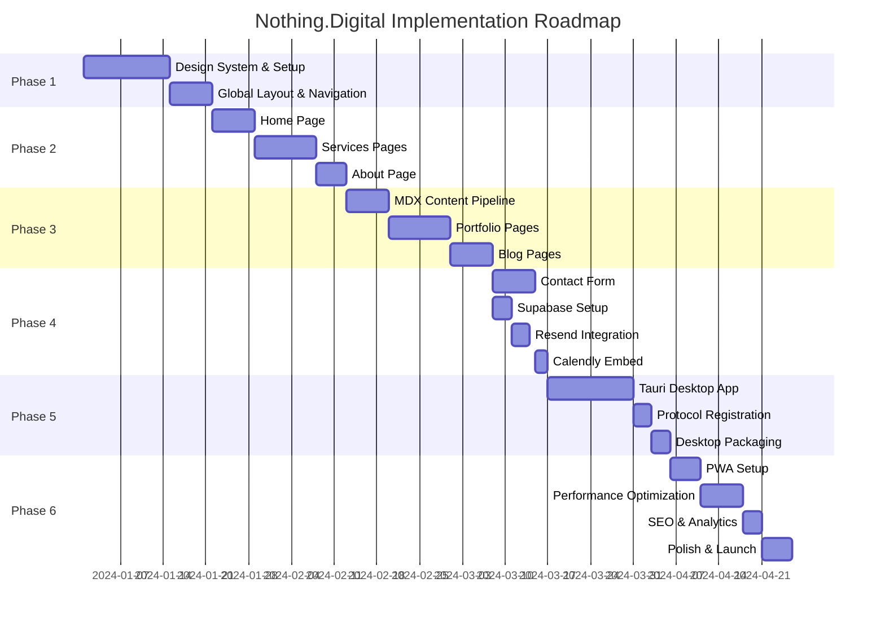

### 7.2 Phase 1: Foundation & Design System (Weeks 1–3)

| Task | Description | Deliverable |
|------|-------------|-------------|
| Project scaffolding | Next.js 14 + TypeScript + Tailwind + shadcn/ui | Running dev server |
| Folder structure | Atomic design folders, content directories | Organized codebase |
| Theme configuration | Tailwind config, CSS variables, dark/light tokens | `globals.css`, `tailwind.config.ts` |
| Core atoms | Button, Badge, Icon, Divider, Container | Reusable atom components |
| Layout templates | MarketingLayout, MinimalLayout | Layout wrappers |
| Navigation | Desktop nav, mobile hamburger menu, theme toggle | `<Navigation />` component |
| Footer | Links, social icons, newsletter mini-form | `<Footer />` component |
| Animation setup | Framer Motion provider, PageTransition, ScrollReveal | Animation system ready |

### 7.3 Phase 2: Core Pages (Weeks 4–6)

| Task | Description | Deliverable |
|------|-------------|-------------|
| Home page | Hero, Services preview, Portfolio preview, Testimonials, Stats, CTA | `/` page complete |
| Services index | Grid of 4 services, process section | `/services` page |
| Service detail pages | 4 individual service pages with unique content | `/services/[slug]` pages |
| About page | Story, values, team, timeline | `/about` page |
| Static content | Service descriptions, team data in config files | `lib/data/*.ts` |

### 7.4 Phase 3: Portfolio & Blog (Weeks 7–9)

| Task | Description | Deliverable |
|------|-------------|-------------|
| MDX pipeline | next-mdx-remote, gray-matter, content directory | Content loading utilities |
| Portfolio list | Filterable grid, pagination | `/portfolio` page |
| Portfolio detail | Case study layout, results, testimonial | `/portfolio/[slug]` pages |
| Blog list | Post grid, tag filtering | `/blog` page |
| Blog detail | MDX rendering, code blocks, images | `/blog/[slug]` pages |
| Sample content | 2-3 case studies, 2-3 blog posts | Content in `content/` |

### 7.5 Phase 4: Contact, Forms, Integrations (Weeks 10–11)

| Task | Description | Deliverable |
|------|-------------|-------------|
| Contact page | Form layout, Calendly embed, contact info | `/contact` page |
| Contact form | React Hook Form + Zod validation | `<ContactForm />` component |
| Supabase setup | Project, tables, RLS policies | Working database |
| API routes | `/api/contact`, `/api/newsletter` | Server endpoints |
| Resend integration | Email templates, API calls | Automated emails |
| Form submission flow | End-to-end test: form → DB → email | Verified workflow |
| Newsletter form | Footer + dedicated section | `<NewsletterForm />` |

### 7.6 Phase 5: Desktop App (Weeks 12–14)

| Task | Description | Deliverable |
|------|-------------|-------------|
| Tauri project init | `cargo create-tauri-app`, configure | Tauri project scaffolded |
| Window chrome | Custom address bar showing `nothing://` | Desktop UI shell |
| Protocol registration | Deep link plugin, OS registration | `nothing://` opens app |
| WebView loading | Load Next.js build in Tauri WebView | App displays site |
| Protocol resolution | Parse `nothing://path` → route internally | URL routing works |
| Packaging | Code signing, installers (.dmg, .msi, .AppImage) | Distributable apps |
| Auto-updater | tauri-updater integration | Self-updating app |

### 7.7 Phase 6: Polish, PWA, Performance (Weeks 15–16)

| Task | Description | Deliverable |
|------|-------------|-------------|
| PWA manifest | Icons, theme color, display mode | `manifest.json` |
| Service worker | Workbox or custom SW for caching | Offline support |
| Protocol handlers | `web+nothing://` in manifest | PWA deep links |
| Performance audit | Lighthouse 90+ on all pages | Performance scores |
| Image optimization | next/image, WebP, responsive sizes | Optimized assets |
| SEO | Meta tags, Open Graph, sitemap.xml, robots.txt | Search-ready |
| Analytics | Plausible or GA4 integration | Tracking live |
| Final testing | Cross-browser, mobile, accessibility | Launch-ready |

### 7.8 Technology Decisions Summary

| Decision | Choice | Rationale |
|----------|--------|-----------|
| Framework | Next.js 14 App Router | SSR/SSG/ISR, React Server Components, SEO |
| Styling | Tailwind CSS + shadcn/ui | Rapid development, consistent design system |
| State | Zustand (UI) + React Query (server) | Minimal boilerplate, excellent DX |
| Forms | React Hook Form + Zod | Type-safe, performant, great DX |
| Animation | Framer Motion | Declarative, excellent React integration |
| Content | MDX | Markdown + JSX components for rich content |
| Database | Supabase PostgreSQL | Managed Postgres, generous free tier |
| Email | Resend | Modern API, great deliverability, generous free tier |
| Desktop | Tauri | 5MB bundles, native performance, Rust backend |
| Analytics | Plausible | Privacy-first, no cookie banner needed |

### 7.9 Estimated Effort

| Phase | Duration | Complexity |
|-------|----------|------------|
| Phase 1: Foundation | 2–3 weeks | Medium |
| Phase 2: Core Pages | 2–3 weeks | Medium |
| Phase 3: Portfolio & Blog | 2–3 weeks | Medium-High |
| Phase 4: Forms & Integrations | 1–2 weeks | Medium |
| Phase 5: Desktop App | 2–3 weeks | High |
| Phase 6: Polish & Launch | 1–2 weeks | Medium |
| **Total** | **10–16 weeks** | **High** |

### 7.10 Risk Assessment

| Risk | Likelihood | Impact | Mitigation |
|------|------------|--------|------------|
| Tauri protocol registration issues on macOS | Medium | High | Test early, use official deep-link plugin, document edge cases |
| Resend deliverability to spam | Low | Medium | Set up SPF/DKIM, use verified domain, monitor reputation |
| MDX build times grow with content | Medium | Low | ISR for blog, optimize MDX compilation, consider content layer |
| Calendly embed performance | Low | Low | Lazy load, show placeholder until ready |
| Cross-browser animation inconsistencies | Medium | Low | Use Framer Motion's built-in fallbacks, test on target browsers |

---

## Appendix A: Environment Variables Template

```bash
# .env.local

# Supabase
SUPABASE_URL=https://your-project.supabase.co
SUPABASE_SERVICE_KEY=eyJ...
NEXT_PUBLIC_SUPABASE_ANON_KEY=eyJ...

# Resend
RESEND_API_KEY=re_...

# Analytics (choose one)
NEXT_PUBLIC_GA_ID=G-XXXXXXXXXX
# or
# Plausible uses data-domain attribute, no env var needed

# Calendly
NEXT_PUBLIC_CALENDLY_URL=https://calendly.com/nothing-digital/30min

# General
NEXT_PUBLIC_SITE_URL=https://nothing.digital
```

## Appendix B: Package Dependencies

```json
{
  "dependencies": {
    "next": "^14.0.0",
    "react": "^18.2.0",
    "react-dom": "^18.2.0",
    "typescript": "^5.3.0",
    "tailwindcss": "^3.4.0",
    "@radix-ui/react-*": "latest",
    "class-variance-authority": "^0.7.0",
    "clsx": "^2.0.0",
    "tailwind-merge": "^2.0.0",
    "framer-motion": "^10.0.0",
    "zustand": "^4.4.0",
    "@tanstack/react-query": "^5.0.0",
    "react-hook-form": "^7.48.0",
    "@hookform/resolvers": "^3.3.0",
    "zod": "^3.22.0",
    "lucide-react": "^0.294.0",
    "next-mdx-remote": "^4.4.0",
    "gray-matter": "^4.0.0",
    "@supabase/supabase-js": "^2.38.0",
    "resend": "^2.0.0",
    "react-calendly": "^4.3.0"
  },
  "devDependencies": {
    "@types/node": "^20.0.0",
    "@types/react": "^18.2.0",
    "autoprefixer": "^10.4.0",
    "postcss": "^8.4.0",
    "eslint": "^8.0.0",
    "eslint-config-next": "^14.0.0",
    "vitest": "^1.0.0",
    "playwright": "^1.40.0",
    "@tauri-apps/cli": "^1.5.0"
  }
}
```

---

> **Document Status:** Comprehensive architecture plan complete.  
> **Next Steps:** Begin Phase 1 implementation — project scaffolding and design system.

